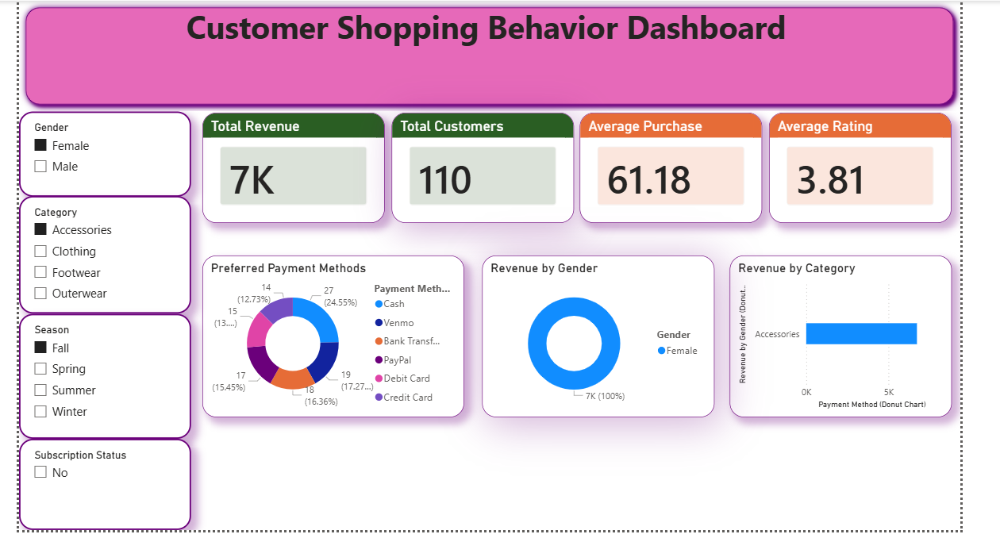
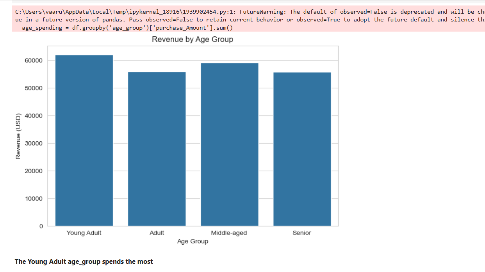
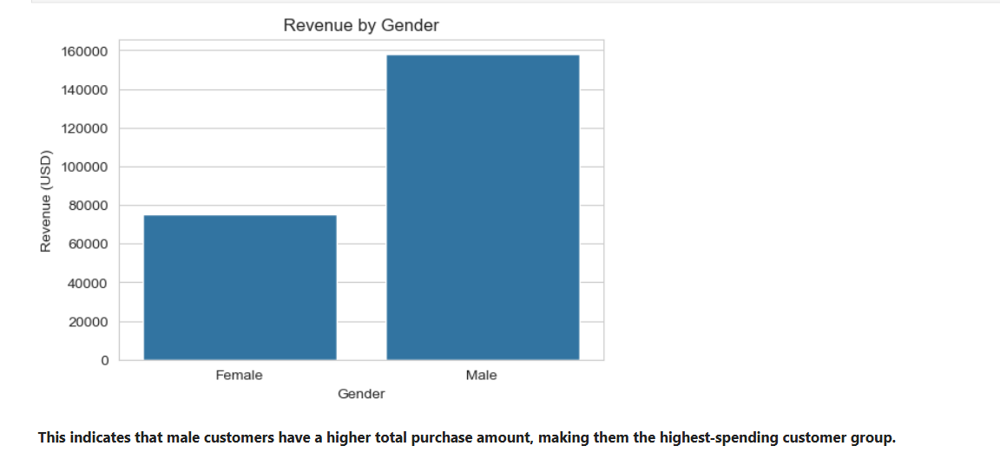

# Customer Shopping Behavior Analysis Dashboard

## Overview

This project analyzes customer shopping behavior using SQL, Python, and Power BI to uncover purchasing trends, customer preferences, revenue drivers, and seasonal sales patterns. The goal is to transform raw transactional data into actionable business insights through Exploratory Data Analysis (EDA), SQL-based analysis, and an interactive Power BI dashboard.

The project combines data analysis techniques with business intelligence reporting to help stakeholders understand customer behavior and make data-driven decisions.

---

## Tools & Technologies

* SQL
* Python
* Pandas
* NumPy
* Matplotlib
* Seaborn
* Power BI

---

## Files Included

* `customer_shopping_behavior.csv` — Source dataset
* `sql_query.sql` — SQL queries used for business analysis
* `customer_dashboard_analysis.pbix` — Power BI dashboard file
* `dashboard.png` — Dashboard preview
* `revenue_by_age.png` — Revenue by Age visualization
* `revenue_by_gender.png` — Revenue by Gender visualization

---

## SQL Analysis

SQL queries were used to answer key business questions and identify trends within the dataset.

Key SQL analyses performed:

* Revenue by product category
* Revenue by gender
* Preferred payment methods
* Seasonal sales trends
* Subscription impact analysis
* Location-wise revenue analysis

---

## Dashboard Preview



---

## Additional Visualizations

### Revenue by Age



### Revenue by Gender



---

## Project Structure

```text
Customer-Shopping-Analysis
│
├── README.md
├── customer_dashboard_analysis.pbix
├── customer_shopping_behavior.csv
├── sql_query.sql
├── dashboard.png
├── revenue_by_age.png
└── revenue_by_gender.png
```

---

## Future Improvements

* Customer Segmentation Analysis
* Customer Lifetime Value (CLV) Analysis
* Predictive Sales Forecasting
* Advanced Power BI Visualizations
* Customer Retention Analysis
